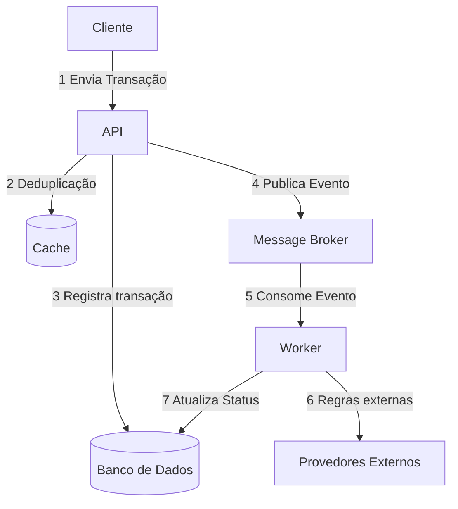
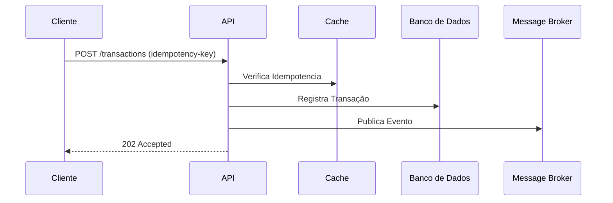
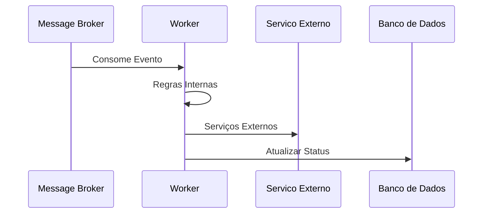
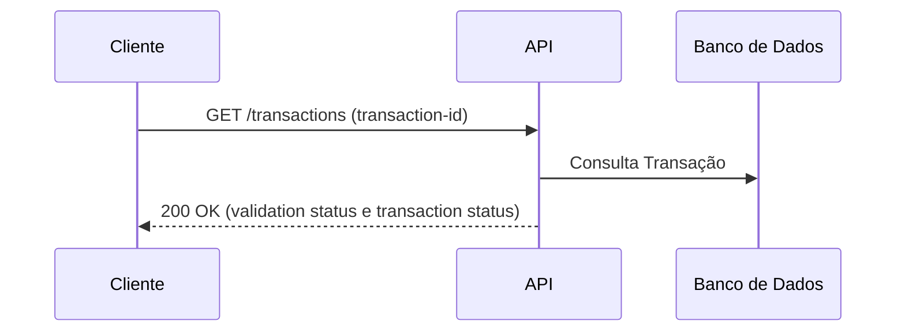

# 🛡️ Serviço de Avaliação Antifraude — Proposta Arquitetural

Este repositório contém a proposta de arquitetura para o **Serviço de Avaliação Antifraude**, uma solução projetada para o processamento de transações financeiras em relação ao risco de fraude, com foco em **alta disponibilidade**, **segurança** e **rastreabilidade**.

---

## 1. Visão Geral da Solução

A arquitetura adota o modelo **Orientado a Eventos (Event-Driven Architecture)** para garantir o desacoplamento entre a solicitação e a análise da transação.

### Componentes Principais

| Componente | Tecnologia | Função |
| :--- | :--- | :--- |
| **API Antifraude** | `.NET` | Ponto de entrada (REST) para recebimento de transações e consulta de status. |
| **Message Broker** | `RabbitMQ` | Gerenciamento da fila de transações para processamento assíncrono. |
| **Worker de Análise** | `.NET` | Executor das regras de negócio e integrações externas para validação. |
| **Cache** | `Redis` | Camada em memória de alta performance para controle de idempotência. |
| **Banco de Dados** | `PostgreSQL` | Persistência das informações para relatórios e auditoria. |

---

## 2. Fluxo de Ponta a Ponta (Happy Path)

O fluxo principal de processamento assíncrono ocorre conforme os passos abaixo:

1. **Envio da Transação:** O *Cliente* envia uma *transação* para validação através da *API*.
2. **Validação e Persistência Inicial:** A *API* valida a idempotência da solicitação, registra a *transação* com status inicial no *Banco de Dados* e publica um evento no *Message Broker*.
3. **Retorno Imediato:** O *ID da transação* é retornado ao *Cliente*. O processamento segue de forma assíncrona.
4. **Consumo & Regras:** O *Worker de Análise* consome o evento do *Message Broker* e executa o motor de regras (internas e de parceiros externos).
5. **Persistência do Resultado:** O resultado da análise (Aprovado/Rejeitado) é atualizado no *Banco de Dados*.
6. **Consulta:** O *Cliente* consulta o resultado final na *API* utilizando o *ID da transação* recebido no passo 3.

---

## 3. Pontos de Resiliência

Para garantir que o sistema seja tolerante a falhas e opere sem perdas de mensagens, foram desenhados os seguintes mecanismos:

* **Retry e Backoff:** Tentativas consecutivas com espaçamento de tempo crescente em chamadas a APIs externas e banco de dados para mitigar instabilidades temporárias.
* **Dead Letter Queue (DLQ):** Mensagens que excedem o limite de retentativas são movidas para uma fila de erro isolada. Isso permite análise posterior, correção de bugs e posterior reprocessamento (replay de mensagens).
* **Mecanismo de Fallback:** Se uma API parceira crítica estiver indisponível, a transação é direcionada para uma fila de **análise manual**. Isso evita o travamento do fluxo operacional e garante que a auditoria seja realizada de forma segura.

---

## 4. Idempotência e Deduplicação

Para evitar reprocessamento e cobranças duplicadas, o sistema atua em duas camadas:

* **Camada de Cache:** Verificação rápida e atômica no *Cache* utilizando a chave `idempotency-key` enviada no cabeçalho da requisição.
* **Constraint no Banco de Dados (Safety Net):** Uma restrição de unicidade no *Banco de Dados* garante a consistência e integridade final na camada de persistência.

---

## 5. Observabilidade

O sistema foi desenhado para permitir o monitoramento, utilizando três pilares fundamentais:

* **Métricas:** Acompanhamento em tempo real de KPIs de negócio e infraestrutura (ex: taxa de aprovação/rejeição, vazão e latência de processamento).
* **Logs Estruturados:** Emissão de logs em formato JSON enriquecidos com `TransactionId` e `CorrelationId` para facilitar buscas em agregadores de log (Elasticsearch/Splunk).
* **Distributed Tracing:** Implementação de `OpenTelemetry` para rastrear toda a jornada de uma transação. Utilizando o `CorrelationId`, é possível mapear o caminho desde a solicitação na API até a execução do processamento em background pelo Worker.

## 6. Diagramas
A. Diagrama de Componentes

B. Diagrama de Sequência
Solicitação de transação

Processamento do Worker

Consulta status da transação

## 7. Decisões Arquiteturais (ADRs)
TODO

## 8. Contrato de API
### 1. Solicitar Análise de Fraude (POST)

Inicia o processo de avaliação de risco de uma transação. Possui mecanismo de idempotência.

* **URL:** `/transactions`
* **Método:** `POST`
* **Headers:**
    * `Idempotency-Key`: `String (GUID)` *(Obrigatório)*

#### Parâmetros do Payload (Request)

| Campo | Tipo | Descrição | Exemplo |
| :--- | :--- | :--- | :--- |
| `TaxId` | String | Apenas números (CPF/CNPJ do cliente) | `12345678901` |
| `Amount` | Decimal | Valor da transação | `250.50` |
| `Currency` | String | Código da moeda (2 caracteres): `R$` (Real), `U$` (Dólar), `E$` (Euro) | `R$` |

#### Respostas (Response)

* **`202 Accepted`**: Retornado quando a transação é recebida com sucesso e entra na fila de processamento.
* **`200 OK`**: Retornado caso a `Idempotency-Key` já tenha sido processada anteriormente (busca realizada no Cache Service).
* **`400 Bad Request`**: Retornado se o header `Idempotency-Key` estiver ausente ou for inválido.

**Exemplo de Corpo da Resposta (200 ou 202):**
```json
{
  "transaction-id": "3fa85f64-5717-4562-b3fc-2c963f66afa6"
}
```
### 2. Consulta Status da Transação (GET)

Retorna o estado atual de processamento e o resultado da validação de fraude de uma transação específica.

* **URL:** `/transactions/{id}`
* **Método:** `GET`
* **URL Params:**
  * `id` [GUID] *(Obrigatório)*: Identificador único da transação (`TransactionId`).

#### Resposta (Response)

* **Código HTTP:** `200 OK`

**Payload de Retorno (JSON):**
```json
{
  "TransactionId": "3fa85f64-5717-4562-b3fc-2c963f66afa6",
  "ValidationStatus": "APPROVED",
  "TransactionStatus": "Processed"
}
```